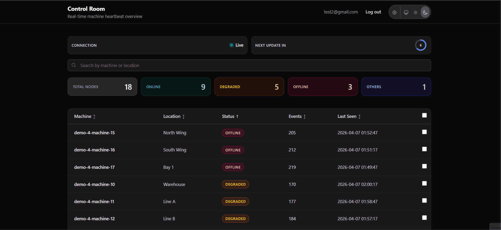
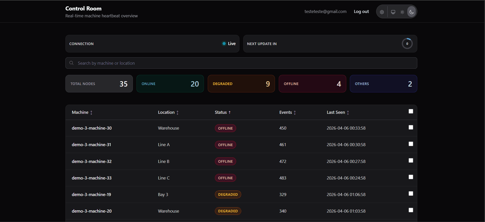
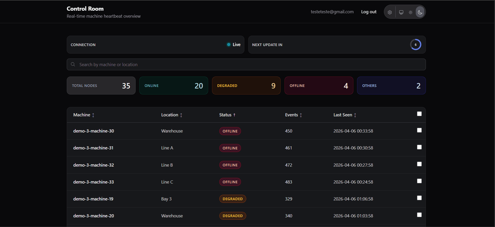

# W-Core - Real-Time State Engine (Elixir/Phoenix)

W-Core is a technical challenge project focused on real-time telemetry ingestion, in-memory processing with ETS, and resilient persistence with SQLite.

## Mission Brief: The Planta 42 Incident

**Mission Context:**
Web-Engenharia was urgently called by an industrial client. "Planta 42," a 24/7 manufacturing complex, is close to a logistics blackout. The operation has thousands of edge devices continuously monitoring machine health.

**The Problem:**
Their legacy monolith can no longer handle the load. Sensors send heartbeats every few seconds with critical metrics. The relational database is suffering constant write locks, control room dashboards are delayed by minutes, and false positives are stopping production.

**Your Mission:**
You were assigned to the W-Core task force to replace this bottleneck with a real-time state engine. The system runs locally on an edge server, uses an embedded database, and must remain reliable under traffic spikes.

Operational directive: "We cannot lose events, the screen must react in real time to machine failures, and history must survive server restarts."

## Documentation

- Main docs: [w_core/docs/README.md](w_core/docs/README.md)
- Step drafts: [w_core/docs/drafts](w_core/docs/drafts)

## Core stack

- Elixir + Phoenix LiveView
- ETS + OTP (GenServer/Supervisor)
- SQLite + Ecto
- Docker release deployment

## Step by Step: Install, Login, and Test

### 1) Install and prepare the environment

Prerequisites:

- Erlang/OTP
- Elixir
- Git

Clone the repository and enter the app folder:

```bash
git clone <URL_DO_REPO>
cd desafio_tecnico/w_core
```

Install dependencies and prepare the local database:

```bash
mix deps.get
mix ecto.setup
```

### 2) Start the app locally

```bash
mix phx.server
```

Open in your browser:

- http://localhost:4000

### 3) Register and login

With the server running:

1. Open Register and create a user.
2. Go to Log in and sign in with that user.
3. If email confirmation is enabled in local development, check the mailbox preview at /dev/mailbox.

### 4) Run tests

In another terminal, from w_core:

```bash
mix test
```

To run only the concurrency/chaos test:

```bash
mix test test/w_core/telemetry_chaos_test.exs --seed 0 --max-cases 1
```

## Main commands

```bash
# run tests
cd w_core
mix test

# run only chaos test
mix test test/w_core/telemetry_chaos_test.exs --seed 0 --max-cases 1

# production build checks
MIX_ENV=prod mix compile
MIX_ENV=prod mix release

# container flow
docker build -t w-core:latest w_core
docker compose -f w_core/docker-compose.yml up --build
```

## Demo (Video/GIF)

<p>
	
</p>
</br>
<p>
	
</p>
</br>
<p>
	
</p>
</br>
<p>
	
</p>
