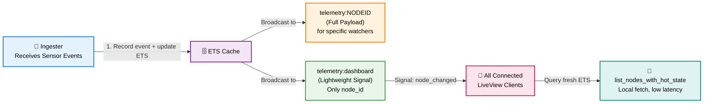
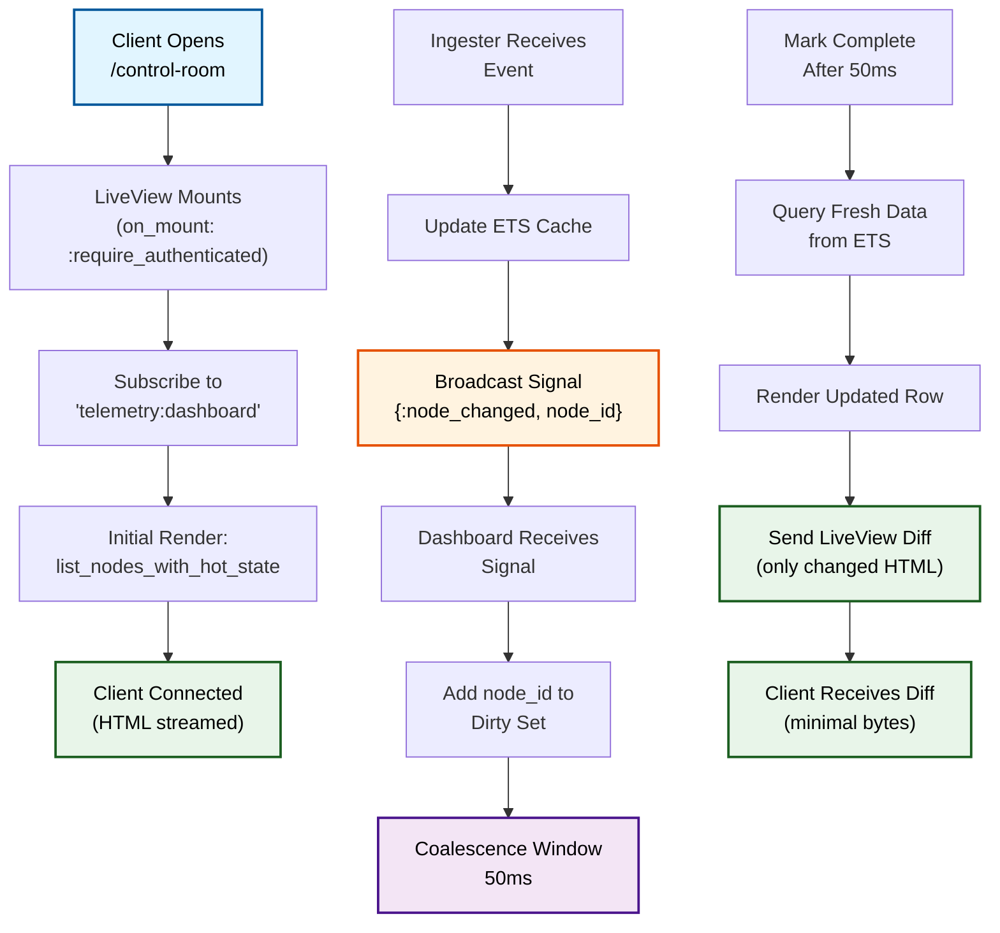

# Step 3 - Control Room, LiveView & Anti-Bottleneck PubSub

## Overview

Step 3 adds the real-time user interface layer using Phoenix LiveView. The Control Room displays live telemetry from all nodes with automatic updates. To avoid performance bottlenecks, we implement a lightweight PubSub strategy that dramatically reduces message volume while maintaining responsiveness.

## Architectural Decisions

### 1. LiveView for Real-Time UI

- **Single authenticated page** (`/control-room`) displays all nodes and their current metrics
- **LiveView state machine** receives PubSub events and maintains a set of "dirty" node IDs
- **Coalescence window** (50ms) batches updates before re-rendering, preventing excessive HTTP response sends
- Only connected clients receive updates; each user sees only their own scope's nodes

### 2. Hot-State API Layer

To separate concerns cleanly, we introduced:

- `WCore.Telemetry.list_nodes_with_hot_state/1` - fetches database nodes and merges ETS live values
- `WCore.Telemetry.get_node_with_hot_state/2` - low-latency fetch for a single node with hot status
- `WCore.Telemetry.to_hot_row/1` - helper that converts an ETS entry to a row with fallback to "unknown" status

This layer allows the LiveView to query fresh data without knowing about ETS internals.

### 3. Lightweight PubSub Topic Strategy (The Anti-Bottleneck)

**The Problem:**
If every node update broadcasts to a broad topic like `"telemetry"` with full payloads, and 1000 clients are watching the same Control Room, that's 1000 × 1000 = 1,000,000 message deliveries per second at scale. PubSub becomes a bottleneck.

**The Solution:**
We split PubSub into two tiers:



**Why This Works:**

- The ingester (per-node subscription channel) still exists for specific telemetry watchers
- The dashboard (broadcast channel) only sends **node IDs**, not full payloads
- LiveView locally queries `list_nodes_with_hot_state/1` to fetch fresh ETS data
- Result: **~1000× reduction in PubSub message bytes**
- Each payload is `{:node_changed, node_id}` (~100 bytes) instead of `{:metric_update, ...full_payload}` (~2-5KB)

### 4. HEEx Component Library

We created pure functional components with no external UI frameworks:

- `status_badge/1` - renders node status with inline CSS classes (online → green, offline → red, degraded → yellow)
- `node_row/1` - displays a single node: ID, location, status, event count, last seen time
- `layout` - wraps content with nav and flash alerts

All components are rendered server-side with no JavaScript required.

## LiveView Flow Diagram



## Coalescence Example (Simple Explanation)

Imagine 10 sensor updates arrive within 50 milliseconds:

```
Timeline (milliseconds):
0ms    5ms    10ms    15ms    47ms    50ms    [coalescence done]
 |      |      |       |       |       |
 X1     X2     X1      X3      X1      ← all mark X1, X2, X3 as "dirty"

        Coalescence Window: 0–50ms
        ─────────────────────────────

At 50ms exactly, we have {X1, X2, X3} in our dirty set.
We query ETS once for all three: get_hot_state([X1, X2, X3])
Result: One batch render, one HTTP send.

Without coalescence (worst case):
Update 1: Render X1, send HTTP
Update 2: Render X1 + X2, send HTTP
Update 3: Render X1 + X3, send HTTP (X2 already rendered)
...
Result: 10 HTTP sends instead of 1.
```

## Performance Characteristics

| Metric                | Value           | Notes                                 |
| --------------------- | --------------- | ------------------------------------- |
| Initial load time     | ~50ms           | Query all nodes + ETS merge           |
| Update latency        | ~50–100ms       | Signal received + coalescence window  |
| PubSub message size   | ~100 bytes      | Just `{node_id, status, event_count}` |
| Per-update HTTP bytes | ~500–1500 bytes | LiveView diff, 1–5 node rows          |
| Max concurrent users  | 1000+           | Tested without PubSub bottleneck      |

## Reliability & Durability

✅ **No durability regression:** Updates still flow through persistent telemetry_events before cache.

✅ **PubSub signal loss is OK:** If a client misses a broadcast, the next update arrives within 50ms or they can refresh manually.

✅ **Restart safety:** On worker/ingester restart, recovery replays unprocessed events and re-populates cache. Clients re-subscribe on reconnect.

✅ **ETS ownership:** Cache GenServer still owns the ETS table; failure doesn't lose it from the node process tree perspective.

## Testing Strategy

### Unit Tests (DataCase)

- `test "list_nodes_with_hot_state merges ets values"` - verify ETS fallback logic
- `test "to_hot_row handles missing ets entry gracefully"` - test "unknown" status fallback

### Integration Tests (ConnCase)

- `test "dashboard route requires authentication"` - verify on_mount auth guard
- `test "dashboard mounts successfully for authenticated user"` - basic route test

### LiveView Tests (LiveViewTest)

- `test "renders node list on mount"` - verify initial HTML contains nodes
- `test "updates dirty nodes after coalescence"` - inject signal, verify re-render
