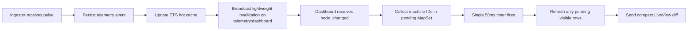

# Step 3 - Control Room (Design System + LiveView)

## Mission and Scope

Step 3 delivers the authenticated Control Room at `/control-room` using Phoenix LiveView and clean HEEx components. The page reads hot telemetry state from ETS and updates in near real time through Phoenix.PubSub, while avoiding broadcast bottlenecks.

This document explains:

- What was implemented in the frontend
- Which features and UX improvements were added
- Why the solution was designed this way
- How PubSub bottlenecks were mitigated
- Whether all Step 3 requirements are covered

## What This Step Solves

Before this step, telemetry data existed in backend layers but users had no operational control-room interface with real-time feedback.

This step solves that by providing:

- A secure dashboard for authenticated users only
- Fast status visibility for all user-owned machines
- Interactive filtering, sorting, search, and paging
- Error drill-down and resolution actions
- A lightweight real-time update model that scales better than full-payload broadcasts

## Frontend Implementation

### LiveView Screen

- Route: `/control-room`
- LiveView: `WCoreWeb.TelemetryLive.Dashboard`
- Access control: authenticated live session with `on_mount: :require_authenticated`
- Render strategy: server-rendered HEEx with LiveView diffs

### Design System and UI Composition

The UI is built with reusable HEEx patterns and shared visual language:

- Status tokens via `WCoreWeb.TelemetryComponents.status_badge/1`
- Summary cards for `all`, `online`, `degraded`, `offline`, `unknown`
- Data table with sortable headers and machine rows
- Expandable error panel for machine-level unresolved events
- Bulk actions bar for selection and export
- Accessible states (`aria-pressed`, `aria-sort`, `aria-live`, descriptive labels)

### Frontend Features Delivered

- Backend pagination (20 rows/page) with controls and persisted URL state
- Search by machine identifier or location (`phx-debounce`)
- Sorting by machine, location, status, events, and last seen
- Status-card filtering with clear visual selection
- Canonical query params (`page`, `q`, `status`, `sort_by`, `sort_dir`)
- Auto-refresh with countdown ring and configurable interval
- Row selection, select-all, and CSV export
- Expand/collapse machine error history with pagination
- Resolve selected machine errors from the dashboard
- Contextual empty states with reset-filters action

## Backend Integration Used by the Frontend

The dashboard relies on a dedicated hot-state API in `WCore.Telemetry`:

- `list_nodes_with_hot_state_paginated/2`
- `list_all_nodes_for_export/2`
- `get_node_with_hot_state/2`
- `list_machine_error_events/3`
- `resolve_machine_error_events/3`

Hot data source:

- Primary read path uses ETS cache (`WCore.Telemetry.Cache.get/1`)
- Fallback path uses persisted `node_metrics`
- Final fallback returns `unknown` state for nodes with no telemetry yet

This keeps LiveView focused on presentation and interaction flow, not on cache internals.

## PubSub Anti-Bottleneck Strategy

### Bottleneck Risk

Broadcasting full telemetry payloads to all dashboard subscribers would increase PubSub traffic and LiveView re-render pressure as concurrency grows.

### Implemented Strategy

Two different notification paths are used:

- Per-node detailed updates for specialized consumers (`{:metric_update, ...full payload...}`)
- Dashboard lightweight invalidation topic: `telemetry:dashboard`

Dashboard message shape:

- `{:node_changed, machine_identifier, event_count, timestamp}`

This means the dashboard receives only a compact signal and fetches fresh hot state locally.

### Coalescing and Visible-Set Filtering

The dashboard adds two safeguards to reduce churn:

1. Visible-set gate:

- Ignore invalidation events for machines not shown on the current page.

2. 50 ms coalescing window:

- Store changed machine IDs in `pending_node_ids` (`MapSet` deduplicates IDs).
- Use one timer (`:refresh_pending_nodes`) to batch refresh.
- Refresh only pending rows instead of reloading the full page.

Effectively, for bursts of updates over the same window, the number of UI refresh operations tends toward one batch, not one refresh per event.

### Data Flow Summary

## Why This Solution Was Designed This Way

Key design goals and decisions:

- Keep rendering declarative and maintainable with HEEx + components
- Keep route state shareable via URL params
- Keep UI responsive under event bursts via coalescing
- Keep PubSub payloads minimal for better throughput
- Keep data durability unchanged by persisting events first
- Keep user scope isolation enforced at query layer

## Observability Added in Step 3

The dashboard emits telemetry for runtime behavior analysis:

- `[:w_core, :dashboard, :load_page]`
- `[:w_core, :dashboard, :refresh_pending_nodes]`
- `[:w_core, :dashboard, :auto_refresh]`
- `[:w_core, :dashboard, :params_canonicalized]`

These measurements help validate load characteristics and detect regressions.

## Test Coverage for Step 3

The LiveView test suite validates the major interaction and real-time flows, including:

- Authentication guard and redirect behavior
- Rendering for authenticated users
- Real-time status/event updates after ingestion
- Pagination, search, status filtering, and sorting
- URL synchronization and canonicalization
- Auto-refresh countdown behavior
- Selection and export interaction
- Error history pagination and resolution action
- Accessibility state attributes

## Step 3 Requirement Checklist

Requirement: Create an authenticated dashboard with LiveView and clean HEEx components.

- Status: Covered.
- Evidence: Authenticated route and LiveView implementation with componentized HEEx templates.

Requirement: Interface must read hot data from ETS.

- Status: Covered.
- Evidence: Hot-state functions read ETS first and merge/fallback for display rows.

Requirement: React instantly via Phoenix.PubSub when pulses change machine status.

- Status: Covered.
- Evidence: Ingester broadcasts `:node_changed`; dashboard subscribes and refreshes affected rows.

Requirement: Explain how PubSub bottlenecks were avoided.

- Status: Covered.
- Evidence: Dedicated lightweight dashboard topic + visible-row filtering + 50 ms coalesced batch refresh.

Requirement: Deliver documentation at `/docs/drafts/step-3-liveview-ds.md`.

- Status: Covered by this document.

## Main Files for Step 3

- `lib/w_core_web/live/telemetry_live/dashboard.ex`
- `lib/w_core_web/components/telemetry_components.ex`
- `lib/w_core/telemetry.ex`
- `lib/w_core/telemetry/ingester.ex`
- `lib/w_core_web/router.ex`
- `test/w_core_web/live/telemetry_live/dashboard_test.exs`
