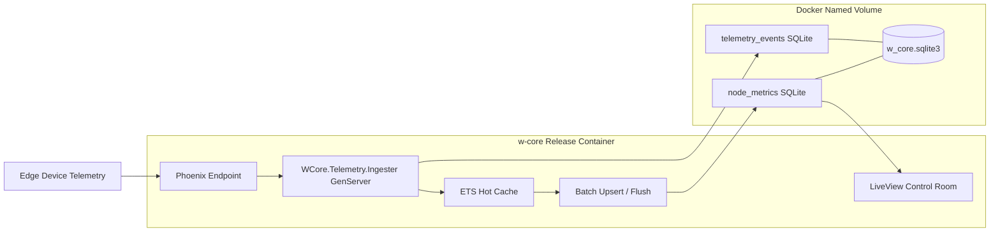

# Step 5 - Edge Packaging (Infrastructure)

## Mission

Package the application as an optimized Elixir release in Docker and guarantee SQLite persistence through a mounted volume.

## Current State (What Already Exists)

The project already has strong Step 5 foundations:

- Multi-stage Docker build in `Dockerfile` (builder + runner).
- `mix release` generation in production mode.
- Runtime database path driven by `DATABASE_PATH` in `config/runtime.exs`.
- Persistent volume already declared in container (`/app/data`).
- Startup command runs migrations before boot.
- Build context hygiene via `.dockerignore`.

## Implementation Status

Implemented in this step:

1. Runtime orchestration artifact: `docker-compose.yml` added.
2. Container hardening in `Dockerfile`:

- dedicated non-root user (`wcore`);
- `/app` ownership assigned to app user;
- runtime now executes as non-root.

3. Operational observability:

- `HEALTHCHECK` added in `Dockerfile`;
- `healthcheck` + `restart: unless-stopped` added in `docker-compose.yml`.

4. Persistence runbook documented (build, run, recreate, and verify named volume).
5. Final architecture diagram and verification checklist documented in this file.

---

## Step-by-Step Execution Runbook

## Phase 1 - Infrastructure Artifacts (Completed)

1. Keep current multi-stage `Dockerfile` as release baseline.
2. Harden `Dockerfile` runtime:

- create dedicated app user;
- set ownership for `/app`;
- run release as non-root.

3. Add `docker-compose.yml` for repeatable edge execution:

- image build from local context;
- `4000:4000` mapping;
- runtime environment variables (`PHX_SERVER`, `SECRET_KEY_BASE`, `DATABASE_PATH`, `PHX_HOST`, `PORT`);
- named volume mounted at `/app/data`;
- restart policy.

4. Add healthcheck in both Docker runtime path and compose service.

## Phase 2 - Build and Run

1. Build image:

```bash
cd w_core
docker build -t w-core:step5 .
```

2. Run with a named volume:

```bash
docker run --name w-core-step5 \
  -p 4000:4000 \
  -e SECRET_KEY_BASE=$(mix phx.gen.secret) \
  -e PHX_SERVER=true \
  -e PHX_HOST=localhost \
  -e PORT=4000 \
  -e DATABASE_PATH=/app/data/w_core.sqlite3 \
  -v wcore_data:/app/data \
  w-core:step5
```

3. Confirm app is up:
   - open `http://localhost:4000`;
   - verify container health/status.

Alternative using compose:

```bash
cd w_core
SECRET_KEY_BASE=$(mix phx.gen.secret) docker compose up --build
```

## Phase 3 - Prove Database Persistence

1. Create real data (through app UI or endpoint).
2. Stop and remove container, keeping the named volume:

```bash
docker stop w-core-step5
docker rm w-core-step5
```

3. Start again using the same named volume `wcore_data`.
4. Verify previous data still exists (same users/nodes/metrics visible).
5. Inspect volume metadata if needed:

```bash
docker volume inspect wcore_data
```

Success criterion: data survives container recreation because SQLite file remains in mounted volume.

## Phase 4 - Release Validation Checklist

1. Build is deterministic and succeeds from clean cache.
2. Container starts with migrations and serves traffic.
3. Application writes SQLite at `/app/data/w_core.sqlite3`.
4. Data survives stop/remove/recreate using same named volume.
5. Runtime does not require root privileges.
6. Healthcheck and restart behavior are documented and reproducible.

## Validation Performed In This Workspace

Executed validations:

1. Static validation of changed files:

- `Dockerfile`: no IDE errors;
- `docker-compose.yml`: no IDE errors;
- this document: no IDE errors.

2. Regression validation on application behavior:

- `mix test test/w_core/telemetry_chaos_test.exs --seed 0 --max-cases 1`;
- result: `1 test, 0 failures`.

3. Full test suite execution:

- `mix test`;
- result: `158 tests, 0 failures`.

4. Production build/release validation (outside Docker):

- `MIX_ENV=prod mix compile`;
- `MIX_ENV=prod mix release`;
- result: release generated at `_build/prod/rel/w_core`.

---

## Final Architecture Flow



## Deliverables for Step 5

1. Hardened `Dockerfile` for production release runtime.
2. `docker-compose.yml` for repeatable edge deployment.
3. Persistence proof execution runbook (commands + expected outcomes).
4. This document: `docs/drafts/step-5-infra-arch.md`.
